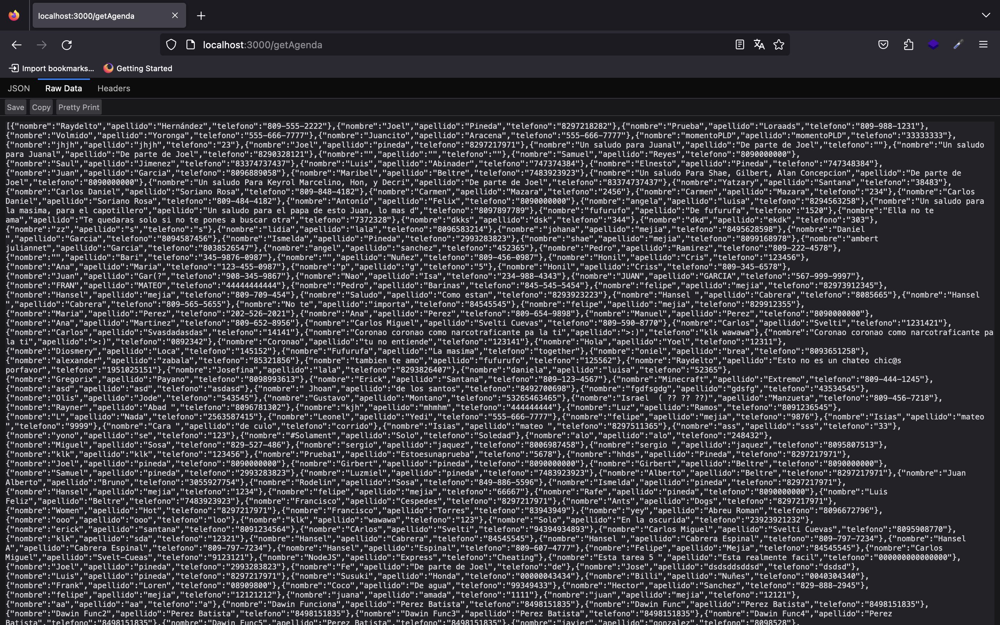

Tarea 5 - Servicio WEB
By: Romantiezer Rodríguez Pérez - 2022 0721

Para usar, debe clonar el respositorio y luego en consola escribir
'npm install' o 'npm i', para instalar las librerías y usar la app

Captura de pantalla: 

